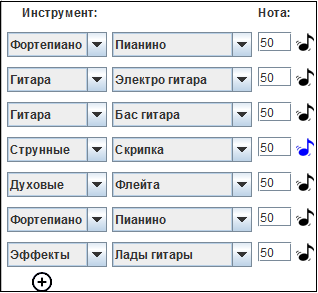
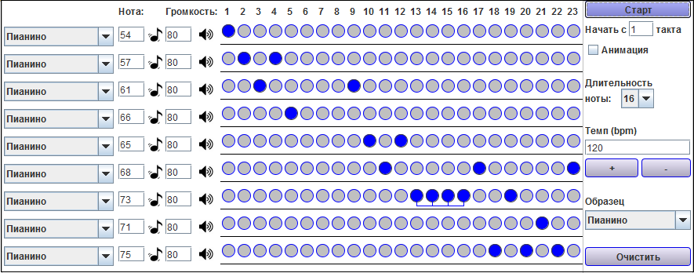
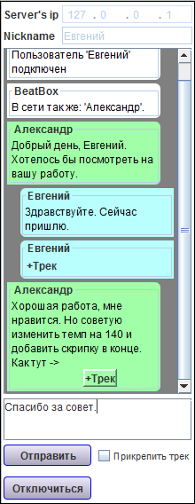
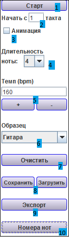
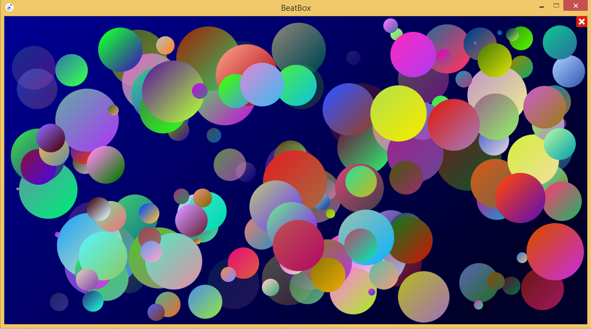

# BeatBox  
**BeatBox** - это десктопное приложение для командной разработки музыкальных треков в формате MIDI.

Главное предначначение приложения - **создание музыки**

>Это простой музыкальный редактор способный *синтезировать* звуки *разнообразных* музыкальных инструментов. 

**В самом простом случае** после запуска программы пользователь может  выбрать музыкальный **инструмент**, **ноту** и **такты**, в момент которых будет воспроизводиться звук (**такты**). После нажатия на кнопку **старт**, пользователь услышит мелодию, которую только что сам создал.

### Это только начало!

Пользователь может создать до 15 музыкальных дорожек, которые будут параллельно воспроизводить свои уникальные звуки. Длина трека ограничивается 100 тактами. Есть возможность настроить длительность ноты и темп. Таким образом данное приложение способно синтезировать достаточно сложные и большие музыкальные треки.

Попробуйте сами выбрать свой любимый музыкальный инструмент и создать приятную мелодию, а после экспортировать ее в формат “*.mid*”, который воспроизводится большинством проигрывателей.

### Одна из главных особенностей! 
**Коллективная разработка**. 

 В программе есть свой **встроенный чат**, который позволяет пользователям программы общаться между собой и делиться созданными треками. 
 
 Таким образом можно коллективно вносить изменения в один трек, добавляя в него новые музыкальные инструменты и звуки и улучшая имеющиеся.

###Возможности 
В правом углу программы располагается функциональная панель, которая реализует следующие возможности: 

    1.	Запуск и остановка созданного трека, кнопка при нажатии меняет название на «Стоп»
    2.	Указание, с какого такта запустить трек, для более удобной разработки;
    3.	Указание запускать ли анимационную игру или просто прослушать созданный трек;
    4.	Выбор длительности ноты (4, 8, 16, 32);
    5.	Увеличение и уменьшение темпа;
    6.	Выбор примера создаваемого трека;
    7.	Очистить рабочую зону, убрав все настройки;
    8.	Сохранить или загрузить трек (для сохранения создается файл с форматом .bbx);
    9.	Экспорт в midi-файл. Кнопка открывает дочернее окно выбора настроек и экспорта;
    10.	Для более удобного выбора номера ноты открывается окно с таблицей, по которой можно ориентироваться

###  Приятный бонус! 

**Анимационная мини игра**. Если при запуске трека нажать на CheckBox «Анимация», то запустится Анимационная мини игра *«Космос»* 

>При воспроизведении каждого звука будет генерироваться красивая абстрактная окружность на темно синем фоне. Вы можете насладиться получившийся на основе вашего трека картинкой или начать уничтожать окружности, нажимая на них.

### Downland 
+ [BeatBox.jar](out/artifacts/BeatBox_jar/BeatBox.jar) – можете скачать тут
+ [Server.jar](out/artifacts/Server_jar/Server.jar) – можете скачать тут (для работы чата необходимо запустить сервер, сервер лучше запускать через командную строку)
